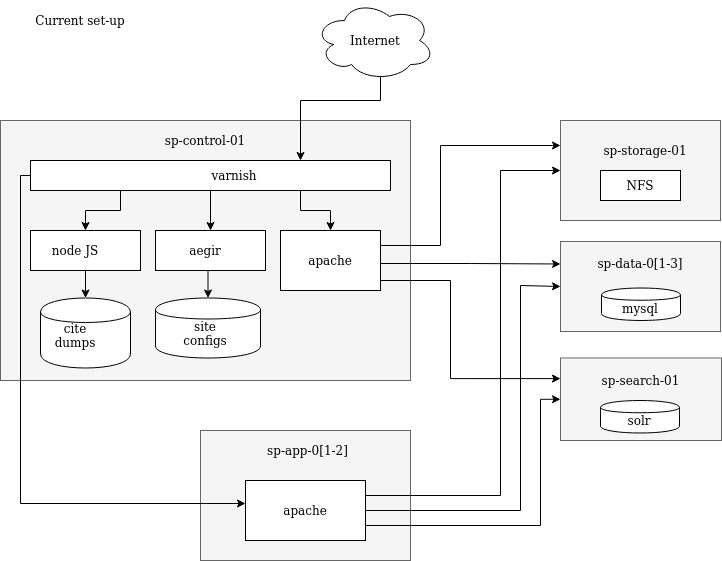
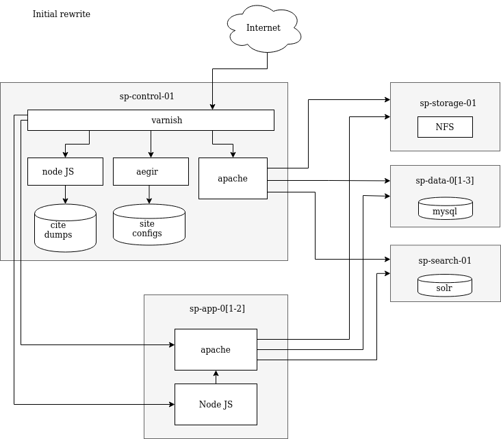
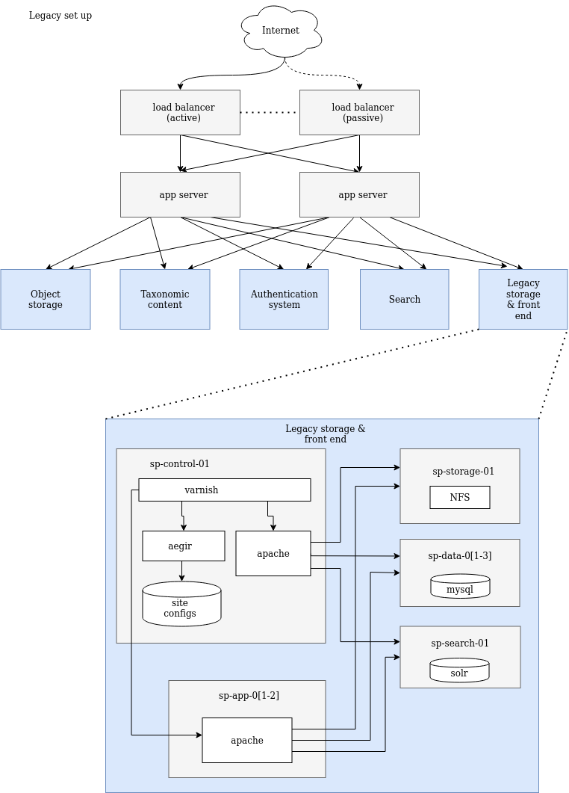
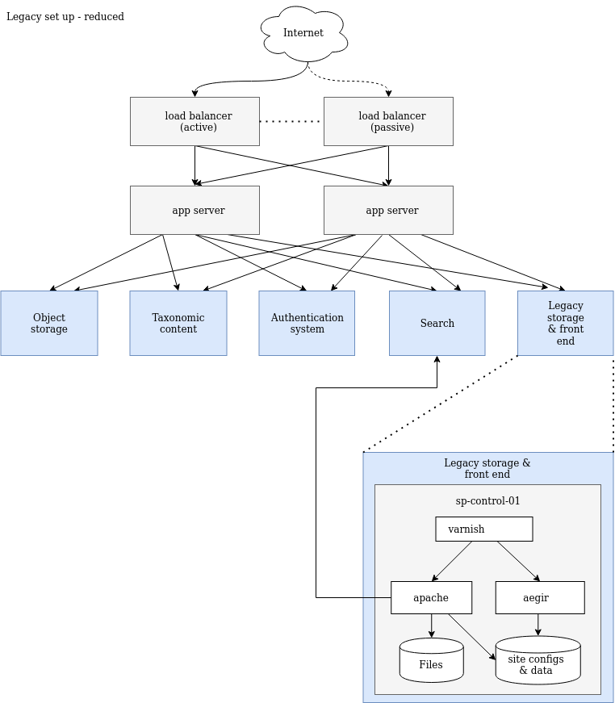

# Approach

## Front-end-first migration

An important part of the migration process is that new code must be available to users as soon as possible, on a feature-by-feature basis, without requiring the entire replacement platform to be complete first. If we do not ensure this, users may begin to feel forgotten, since developers cannot realistically work on the new and old platforms simultaneously. Delivering incrementally also means users can test code and highlight bugs or issues over the entire development period, rather than all at once at the end.

This process is easily achievable using the UI/Gateway architecture outlined in the previous document, by developing a legacy gateway that reads and writes to the Drupal application using an http API. The new front-end can then be developed without any direct knowledge of the Drupal system, meaning the eventual data migration will not require rewriting any front-end code. As new UI features are developed, users can either opt-in to the new front-end or be served it as default, falling back to the legacy front-end for pages that haven't been implemented.

## Phased approach

## Phase 1 – First new code to production

 - New platform runs on existing VMs
 - Headless mode for serving data
 - Pre-existing pages served by Drupal
 - New platform serves only brand-new pages
 - New platform page template includes site title, logo, colour scheme, menu links - as set in Drupal
 - All data models used by new platform well defined (RDF) and documented
 - Full test coverage for new code

## Phase 2 – Begin feature rewrite

 - Developers begin to re-write existing features on a per-page basis.
 - Maintainers and users can opt-in to use the new front-end where available.
 - Development priorities and direction are driven and verified by data.
 - Prioritisation of features based on e.g. the most frequently visited URLs.
 - Interface development driven by data from UX research.

 ## Phase 3 – Deprecate scratchpads2

 

  - Most used features of a default Scratchpad install have been completed.
 - By default, new sites are created without a legacy Drupal backend, but may request one.
 - Requests are served by redundant load balancer pair and all new app servers & backend servers.
 - Legacy page requests are forwarded to legacy VM system.
 - Maintainers are encouraged to migrate legacy sites platform, losing legacy backend.
 - Feature & performance regressions are monitored.

 ## Phase 4 - End of Legacy

 

 - Vast majority of sites have been migrated to new platform.
 - Remaining legacy sites have 3 options:
   - Migrate to (possibly customized) version of new platform (or another platform)
   - Self-host on scratchpads2 docker container
   - Get deleted
 - Legacy scratchpads servers are shut down.
 - Celebrate with a party.

## Project plan

1. Create basic RPC interface for Drupal
2. Create basic front end and gateway
3. Deploy initial application server
4. Modify load balancer to reroute 404 requests to the new application server
5. Start development

## Prerequirements

Before the process begins in earnest it is important to identify services we may wish to use as part of the backend:

 - Data storage (science)
 - Data storage (social)
 - Authentication
 - Search indexing
 - File storage

Althrough these services won't be needed until the UI is much more complete, identifying these services up front will mean a longer period of testing to ensure the selected platforms suit the requirements of Scratchpads.

**Next:** [Platform Evaluation](./4-platform-evaluation/README.md)
